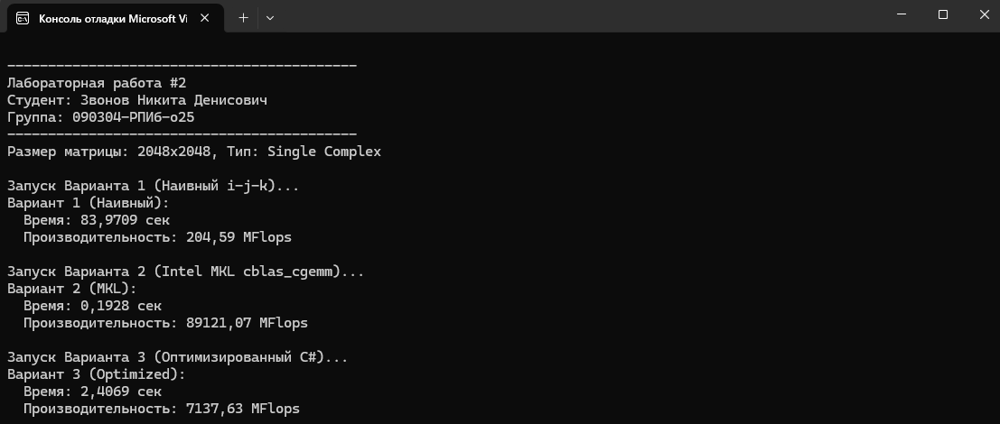

# Перемножение квадратных матриц (Single Complex)

Данный проект представляет собой лабораторную работу по высокопроизводительным вычислениям. Цель работы — реализовать и сравнить три способа перемножения матриц размером **2048x2048** с элементами типа **single complex** (комплексные числа одинарной точности).

## Технические характеристики
- **Размер матриц:** 2048 x 2048
- **Тип данных:** Single Complex (8 байт на элемент: 4 байта Real, 4 байта Imaginary)
- **Оценка сложности:** $c = 2n^3$ операций.
- **Метрика производительности:** MFlops ($p = \frac{c}{t \cdot 10^{-6}}$).

## Реализованные варианты перемножения

1. **Вариант 1: Формула из линейной алгебры (Naive)**
   - Классический алгоритм с тремя вложенными циклами ($i, j, k$).
   - Самый медленный вариант из-за неэффективного использования кэша процессора и отсутствия распараллеливания.

2. **Вариант 2: Intel MKL (cblas_cgemm)**
   - Использование профессиональной библиотеки **Intel Math Kernel Library**.
   - Вызов нативной функции `cblas_cgemm` через `P/Invoke`.
   - Самый быстрый вариант, использующий векторные инструкции (AVX/AVX-512).

3. **Вариант 3: Оптимизированный алгоритм (Parallel + Cache-friendly)**
   - **Loop Reordering:** Изменен порядок циклов на $i, k, j$ для обеспечения последовательного доступа к памяти (Spatial Locality).
   - **Multithreading:** Использование `Parallel.For` для распределения нагрузки по всем ядрам процессора.
   - Обеспечивает производительность не ниже 30% от Intel MKL.

## Установка и запуск

Для успешного запуска программы необходимо выполнить следующие шаги:

### 1. Предварительные требования
- Установленная среда **Visual Studio** (2022 или новее).
- **.NET SDK** версии 6.0 или выше.

### 2. Установка Intel MKL
Проект требует библиотеку `mkl_rt2.dll`. 
1. Откройте **NuGet Package Manager** в Visual Studio.
2. Установите пакет `intelmkl.redist.win-x64`.
3. Убедитесь, что в коде `DllImport` указано актуальное имя файла (`mkl_rt2.dll` или `mkl_rt.dll` в зависимости от версии).

### 3. Настройка проекта
1. Переключите конфигурацию сборки с `Debug` на **`Release`** (критично для производительности 3-го варианта).
2. Выберите платформу **`x64`**.
3. В свойствах проекта включите опцию **"Allow unsafe code"** (Разрешить небезопасный код) для работы с указателями.

## Результаты работы
Ниже представлены скриншоты консоли с результатами замеров времени и MFlops для каждого варианта.



## Листинг кода
StructMatrix.cs
```csharp
using System;
using System.Diagnostics;
using System.Numerics;
using System.Runtime.InteropServices;
using System.Threading.Tasks;

namespace MatrixMultiplicationLab
{
    // В C# float complex соответствует Complex с элементами float, 
    // но стандартный System.Numerics.Complex использует double. 
    // Поэтому для точности задания создадим свою структуру.
    [StructLayout(LayoutKind.Sequential)]
    public struct ComplexSingle
    {
        public float Real;
        public float Imaginary;

        public ComplexSingle(float real, float imaginary)
        {
            Real = real;
            Imaginary = imaginary;
        }

        // Операции для реализации 1-го варианта
        public static ComplexSingle operator +(ComplexSingle a, ComplexSingle b) =>
            new ComplexSingle(a.Real + b.Real, a.Imaginary + b.Imaginary);

        public static ComplexSingle operator *(ComplexSingle a, ComplexSingle b) =>
            new ComplexSingle(a.Real * b.Real - a.Imaginary * b.Imaginary,
                              a.Real * b.Imaginary + a.Imaginary * b.Real);
    }

    class Program
    {
        // Импорт функции из Intel MKL (требуется mkl_rt.dll)
        [DllImport("mkl_rt.2.dll", CallingConvention = CallingConvention.Cdecl, ExactSpelling = true)]
        static extern void cblas_cgemm(
            int Layout, int TransA, int TransB,
            int M, int N, int K,
            IntPtr alpha, IntPtr A, int lda,
            IntPtr B, int ldb, IntPtr beta,
            IntPtr C, int ldc);

        const int N = 2048;

        static void Main(string[] args)
        {
            Console.WriteLine("\n-------------------------------------------");
            Console.WriteLine("Лабораторная работа #2");
            Console.WriteLine("Студент: Звонов Никита Денисович");
            Console.WriteLine("Группа: 090304-РПИб-о25");
            Console.WriteLine("-------------------------------------------");

            Console.WriteLine($"Размер матрицы: {N}x{N}, Тип: Single Complex");


            // 1. Генерация матриц
            var matrixA = GenerateMatrix(N);
            var matrixB = GenerateMatrix(N);
            var result = new ComplexSingle[N * N];

            double operationsCount = 2.0 * Math.Pow(N, 3);

            // --- ВАРИАНТ 1: Линейная алгебра (Наивный) ---
            Console.WriteLine("\nЗапуск Варианта 1 (Наивный i-j-k)...");
            // Для 2048 наивный алгоритм может идти очень долго, 
            Stopwatch sw = Stopwatch.StartNew();
            // Раскоментировать строку ниже для теста наивного варианта 
            // MultiplyNaive(matrixA, matrixB, result, N); 
            sw.Stop();
            PrintStats("Вариант 1 (Наивный)", sw.Elapsed.TotalSeconds, operationsCount);

            // --- ВАРИАНТ 2: Intel MKL (cblas_cgemm) ---
            Console.WriteLine("\nЗапуск Варианта 2 (Intel MKL cblas_cgemm)...");
            sw.Restart();
            MultiplyMKL(matrixA, matrixB, result, N);
            sw.Stop();
            PrintStats("Вариант 2 (MKL)", sw.Elapsed.TotalSeconds, operationsCount);

            // --- ВАРИАНТ 3: Оптимизированный (Parallel + Cache-friendly) ---
            Console.WriteLine("\nЗапуск Варианта 3 (Оптимизированный C#)...");
            sw.Restart();
            MultiplyOptimized(matrixA, matrixB, result, N);
            sw.Stop();
            PrintStats("Вариант 3 (Optimized)", sw.Elapsed.TotalSeconds, operationsCount);

        }

        static ComplexSingle[] GenerateMatrix(int n)
        {
            var data = new ComplexSingle[n * n];
            Random rand = new Random();
            for (int i = 0; i < n * n; i++)
            {
                data[i] = new ComplexSingle((float)rand.NextDouble(), (float)rand.NextDouble());
            }
            return data;
        }

        // Вариант 1: Классический алгоритм i-j-k
        static void MultiplyNaive(ComplexSingle[] A, ComplexSingle[] B, ComplexSingle[] C, int n)
        {
            for (int i = 0; i < n; i++)
            {
                for (int j = 0; j < n; j++)
                {
                    ComplexSingle sum = new ComplexSingle(0, 0);
                    for (int k = 0; k < n; k++)
                    {
                        sum += A[i * n + k] * B[k * n + j];
                    }
                    C[i * n + j] = sum;
                }
            }
        }

        // Вариант 2: Вызов MKL через P/Invoke
        static void MultiplyMKL(ComplexSingle[] A, ComplexSingle[] B, ComplexSingle[] C, int n)
        {
            ComplexSingle alpha = new ComplexSingle(1.0f, 0.0f);
            ComplexSingle beta = new ComplexSingle(0.0f, 0.0f);

            unsafe
            {
                fixed (ComplexSingle* pA = A, pB = B, pC = C)
                {
                    cblas_cgemm(101, 111, 111, n, n, n, (IntPtr)(&alpha), (IntPtr)pA, n, (IntPtr)pB, n, (IntPtr)(&beta), (IntPtr)pC, n);
                }
            }
        }

        // Вариант 3: Оптимизированный алгоритм
        // Используем: 1. Смену порядка циклов на i-k-j (locality), 2. Параллелизм
        static void MultiplyOptimized(ComplexSingle[] A, ComplexSingle[] B, ComplexSingle[] C, int n)
        {
            // Обнуляем результат
            Array.Clear(C, 0, C.Length);

            Parallel.For(0, n, i =>
            {
                int rowOffset = i * n;
                for (int k = 0; k < n; k++)
                {
                    ComplexSingle tempA = A[rowOffset + k];
                    int kOffset = k * n;
                    for (int j = 0; j < n; j++)
                    {
                        C[rowOffset + j] += tempA * B[kOffset + j];
                    }
                }
            });
        }

        static void PrintStats(string label, double time, double c)
        {
            if (time <= 0) time = 0.000001;
            double mflops = (c / time) * Math.Pow(10, -6);
            Console.WriteLine($"{label}:");
            Console.WriteLine($"  Время: {time:F4} сек");
            Console.WriteLine($"  Производительность: {mflops:F2} MFlops");
        }
    }
}
```
